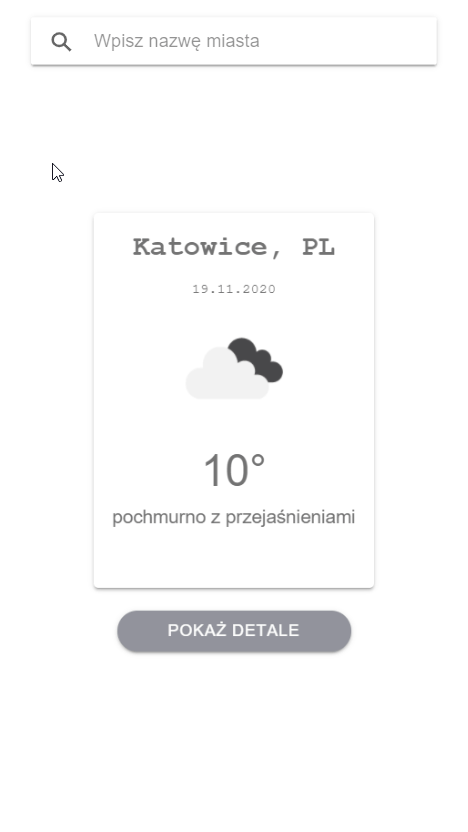

RUN ionic server in console to run application or install APK with your mobile phone.
More info:
https://ionicframework.com/docs/intro/cli
<h1>What is Ionic?</h1>
Ionic is an HTML5 mobile app development framework used to create hybrid mobile apps (iOS, Android, and Windows). Users develop apps using HTML, CSS (SCSS), and JS (TS).

